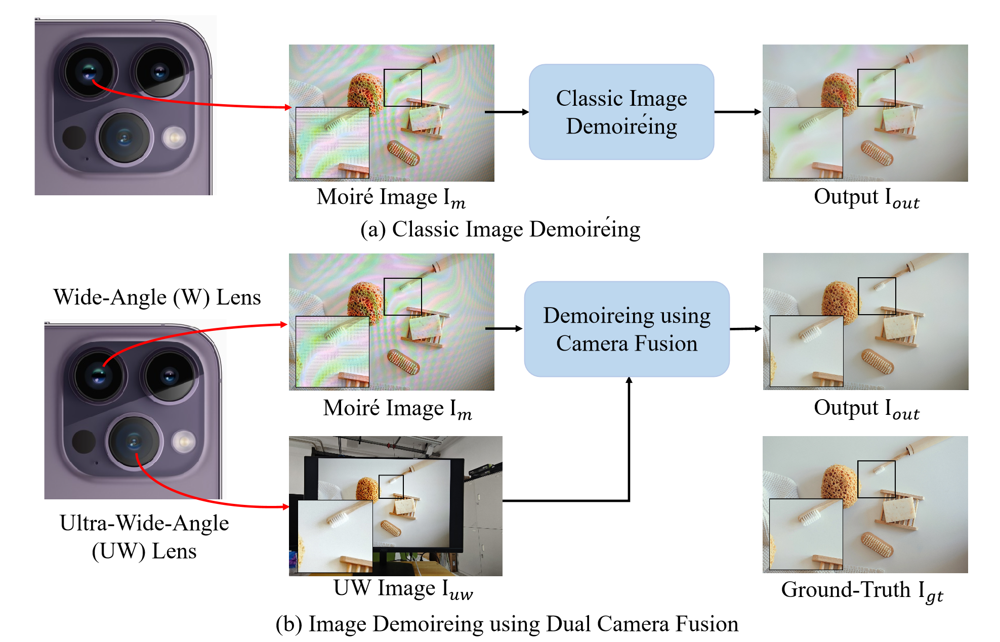

# Image DeMoiréing Using Dual Camera Fusion on Mobile Phones
 IEEE International Conference on Multimedia & Expo 2025 (ICME 2025)
###  [Dataset](https://huggingface.co/datasets/Mrduckk/DCID) | [Paper](https://arxiv.org/pdf/2506.08361)


## Overview

  We propose an efffcient DCID method, where a lightweight UW image encoder is integrated into an existing deMoiréing network and a fast two-stage image alignment manner is present. Moreover, we construct a large-scale real-world dataset with diverse mobile phones and monitors, containing about 9,000 samples. We hope our investigation could inspire more future research in this more practical setting in image demoiréing.
  <div style="text-align: center;">
    
  </div>
  


##  Datasets 
Download Links:

1. Baidu disk: [here](https://pan.baidu.com/s/1IAFmdE4Mkh9ATi2DRspcVQ?pwd=9aab)  (Code: 9aab )

2. HuggingFace: [here](https://huggingface.co/datasets/Mrduckk/DCID)


## Train

The configuration file (config) uses the parameter TRAIN_WORD to denote three different datasets, with each value corresponding to a specific dataset as follows:
- xiaomi: Represents the xiaomi dataset.
- iphone: Represents the iphone dataset.
- p40: Represents the huawei dataset.

The parameter align determines whether to use pre-generated alignment results from Keypoint Matching based Alignment(KMA) during training:
- False: The network will perform the first-stage alignment internally during the training process.
- True: The network will directly use the precomputed alignment results from the align folder.
Specifically, it will use the file named w_align.jpg in the align directory for alignment, skipping the KMA during training.

```
python train.py --config ./config/dcid_config.yaml
```

## Test
pre-trained models on our three datasets: [here](https://pan.baidu.com/s/1mbMAksiBkRshzIPK7coDmg?pwd=9mqy) (Code: 9mqy )

```
python test.py --config ./config/test_dcid_config.yaml
```

## Acknowledgement
This project is built based on [UHDM](https://github.com/CVMI-Lab/UHDM?tab=readme-ov-file).

## Citations

```bibtex
@misc{mei2025imagedemoireingusingdual,
      title={Image Demoir\'eing Using Dual Camera Fusion on Mobile Phones}, 
      author={Yanting Mei and Zhilu Zhang and Xiaohe Wu and Wangmeng Zuo},
      year={2025},
      eprint={2506.08361},
      archivePrefix={arXiv},
      primaryClass={cs.CV},
      url={https://arxiv.org/abs/2506.08361}, 
}
```